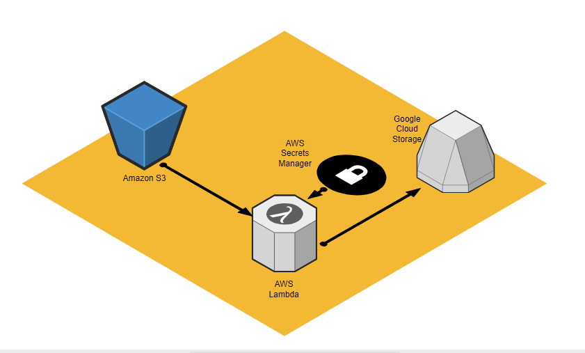

# Data Ingest Lambda - AWS S3 to Google Cloud Storage

## Descripción

Este proyecto implementa una **función AWS Lambda en Java 21**, que transfiere archivos cargados en un bucket S3 directamente hacia un bucket de **Google Cloud Storage (GCS)**. El flujo es 100% serverless y la infraestructura es gestionada completamente como **Infraestructura como Código (IaC)** mediante AWS SAM y Terraform.

---

## Arquitectura



```plaintext
┌────────────────────────────────────┐
│   Usuario / Sistema   │
│   sube archivo a S3   │
└────────────────────────────────────┘
           │ Evento: s3:ObjectCreated
           ▼
┌────────────────────────────────────┐
│ AWS S3 Bucket (IaC)  │
│ (se crea automáticamente) │
└────────────────────────────────────┘
           │
           ▼
┌────────────────────────────────────┐
│  AWS Lambda (Java 21)  │
│ ─ Descarga archivo desde S3  │
│ ─ Usa SDK GCP                │
│ ─ Sube archivo a GCS         │
└────────────────────────────────────┘
           │
           ▼
┌────────────────────────────────────┐
│ Google Cloud Storage (GCS) │
│ (Bucket destino en GCP)    │
└────────────────────────────────────┘
```

---

## Requisitos previos

Para desplegar y utilizar esta solución necesitas:

### ✅ Cuenta AWS activa.

### ✅ Cuenta GCP activa.

### ✅ Permisos suficientes en AWS para:

- Crear buckets S3.
- Crear funciones Lambda.
- Definir roles IAM.
- Crear secretos en AWS Secrets Manager.

### ✅ Permisos en GCP para:

- Crear un bucket en Google Cloud Storage.
- Generar una clave JSON para una cuenta de servicio.

### ✅ Herramientas instaladas:

- AWS CLI configurado (`aws configure`).
- AWS SAM CLI instalado.
- Maven instalado.
- Java 21 instalado.
- Google Cloud SDK (opcional, para validar conexión).
- Terraform instalado.

---

## Infraestructura como Código (IaC)

El archivo `template.yaml` de AWS SAM crea automáticamente:

- Un bucket S3 (`your-source-s3-bucket`).
- La función Lambda.
- El trigger automático entre S3 y Lambda.
- El IAM Role asociado.
- Variables de entorno para controlar el flujo hacia GCP.

El bucket de Google Cloud Storage (GCS) se crea automáticamente mediante Terraform.

---

## Estructura del Proyecto

```plaintext
datasync-migration/
├── template.yaml
├── pom.xml
├── src/main/java/com/cloud/migration/handler/
│       └── DatasyncMigrationHandler.java
├── terraform/
│   ├── main.tf
│   ├── variables.tf
│   ├── terraform.tfvars
└── README.md
```

---

## Despliegue (Build y Deploy)

### Despliegue de AWS (SAM)

#### 1⃣ Compilar el proyecto:

```bash
mvn clean package
```

#### 2⃣ Construir la aplicación SAM:

```bash
sam build
```

#### 3⃣ Desplegar la infraestructura y Lambda:

```bash
sam deploy --guided
```

Durante el despliegue, AWS SAM creará automáticamente:

- El bucket S3.
- La función Lambda.
- El trigger del evento S3.

### Despliegue de GCP (Terraform)

#### 1⃣ Configurar autenticación con GCP:

```bash
gcloud auth application-default login
```

#### 2⃣ Inicializar Terraform:

```bash
cd terraform
terraform init
```

#### 3⃣ Revisar el plan de despliegue:

```bash
terraform plan
```

#### 4⃣ Aplicar el despliegue:

```bash
terraform apply
```

Esto creará automáticamente el bucket de destino en Google Cloud Storage (GCS).

---

## Variables de entorno

| Variable     | Descripción                                                                                         |
| ------------ | --------------------------------------------------------------------------------------------------- |
| `gcsBucket`  | Nombre del bucket destino en Google Cloud.                                                          |
| `projectId`  | ID del proyecto de Google Cloud.                                                                    |
| `secretName` | Nombre del secreto en AWS Secrets Manager (contiene las credenciales JSON del Service Account GCP). |

---

## Gestión del secreto (AWS Secrets Manager)

### 1⃣ Crear el secreto:

```bash
aws secretsmanager create-secret \
    --name gcp-service-account-json \
    --description "Credenciales JSON GCP para Lambda" \
    --secret-string file://ruta/a/tu/gcp-service-account.json
```

Asigna el nombre del secreto a la variable de entorno `secretName`.

### 2⃣ Recuperar el secreto desde Lambda (código Java):

```java
AWSSecretsManager client = AWSSecretsManagerClientBuilder.defaultClient();

GetSecretValueRequest getSecretValueRequest = new GetSecretValueRequest()
    .withSecretId(System.getenv("secretName"));

GetSecretValueResult getSecretValueResult = client.getSecretValue(getSecretValueRequest);

String jsonCredentials = getSecretValueResult.getSecretString();
```

---

## ¿Cómo funciona?

Cada vez que subes un archivo al bucket S3:

- Lambda se activa automáticamente.
- La función descarga el archivo desde S3.
- Usa el SDK de Google Cloud Storage para subirlo al bucket GCS.

---

## Seguridad

- Las credenciales GCP deben almacenarse como un **secreto seguro** en AWS Secrets Manager.
- El Role IAM de la Lambda está restringido:
  - Solo puede leer el bucket S3.
  - Escribir logs en CloudWatch.
  - Leer el secreto con las credenciales de GCP.

---

## Contacto

Paul Rivera.
AWS Certified Solutions Architect - Associate
